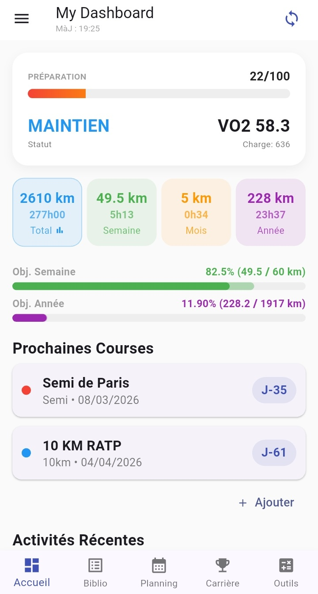

# Garmin Tracker Pro


**Une solution Fullstack "Serverless" pour visualiser mes performances sportives Garmin.**

Ce projet combine une application mobile en **Flutter** avec un backend automatisé en **Python**, le tout orchestré par une pipeline CI/CD sur **GitHub Actions**.

---

## Aperçu de l'Application



---

## Architecture Technique

Ce projet utilise une approche **Monorepo** divisée en deux parties distinctes :

### 1. Backend & Data (Python + GitHub Actions)
L'extraction des données est entièrement automatisée. Pas de serveur à payer, tout tourne sur l'infrastructure GitHub.
* **Script Python :** Se connecte à l'API Garmin Connect pour extraire les dernières activités.
* **Sécurité :** Les identifiants (Email/Password) sont stockés dans les **GitHub Secrets** et injectés temporairement lors de l'exécution.
* **Automation (CI/CD) :** Un workflow (`.yml`) s'exécute toutes les 8 heures pour mettre à jour le fichier `mes_seances.json`.

### 2. Frontend 

* **Architecture :** Clean Architecture.
* **Data Fetching :** Récupère les données JSON brutes directement depuis le dépôt GitHub (via API REST).
* **UI/UX :** Visualisation de données avec graphiques interactifs.

## Installation & Configuration
Si vous souhaitez utiliser ce projet avec vos propres données Garmin, suivez ces étapes :

### 1. Prérequis
Flutter SDK installé
Compte GitHub
Compte Garmin Connect

### 2. Cloner et Forker
Pour que l'automatisation fonctionne avec votre compte, vous devez "Forker" ce dépôt.

Cliquez sur le bouton Fork en haut à droite.

Clonez votre nouveau dépôt :

```Bash
git clone [https://github.com/VOTRE-PSEUDO/garmin-tracker-pro.git]
```

### 3. Configurer les Secrets (Backend)

Allez dans les paramètres de votre dépôt GitHub (Settings > Secrets and variables > Actions) et ajoutez :
GARMIN_EMAIL : Votre email Garmin.
GARMIN_PASSWORD : Votre mot de passe.
L'action GitHub se lancera automatiquement pour récupérer vos données.

### 4. Configurer l'Application (Frontend)
Dans le fichier app/lib/config/app_config.dart :

Générez un Personal Access Token sur GitHub.

Renseignez vos infos :
```Dart
static const String githubUser = "VOTRE-PSEUDO";
static const String githubRepo = "garmin-tracker-pro";
static const String githubToken = "VOTRE_TOKEN";
```
Lancez l'appli : 
```Bash
flutter run
```
## Sécurité & Données
Identifiants : Aucune donnée sensible n'est stockée dans le code. Tout passe par des variables d'environnement sécurisées.

Données : Les statistiques de course sont stockées dans un fichier JSON public à des fins de démonstration.

## Auteur
Anh-Tam - Etudiant ingénieur passioné de course à pied

